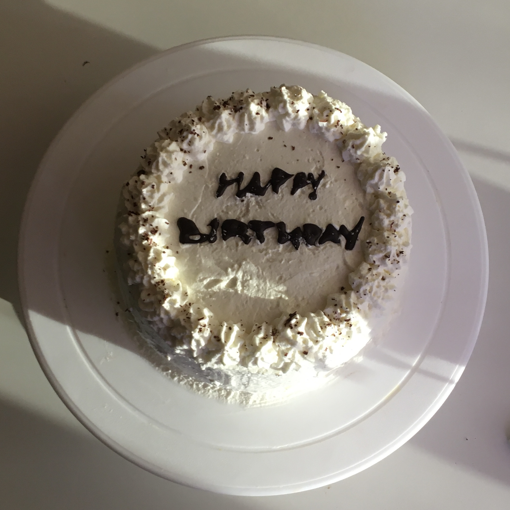
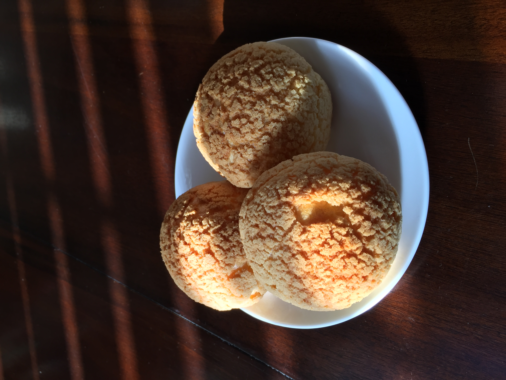

# Julia Le 
>Welcome to my User Page! Scroll to read more about me! 


## UCSD
I'm a Third-Year Computer Engineering Student here at UCSD. I have recently become involved with research here on campus, but I am also interested in developing my programming skills and learning more about industry. 

## Free-time
When given the chance, I like to bake and cook.





## **Research**

### ERSP 
I became invovled in CS research in Fall 2021 when I was accepted into ERSP (Early Researchers Scholar PRogram). There, I learned to apply the fundamentals of research through project proposals and presentations. 

I was paired with the Switzer/Kastner Research Group where I worked with 3 other ERSP members to work on a project over the course of the school year. 

### *Project*

Our project addresses the issue of the carbon impact of currently off the shelf mobile devices and how we can utilize them to prevent hazardous e-waste. 

Our mentor, Jennifer Switzer had created a cluster of 6 phones to serves as a Faas provider for her [paper](https://ieeexplore.ieee.org/document/9695989). We were tasked with expanding upon this project. 

We started off with collecting carbon metrics of mobile devices through environmental reports and create graphs to demonstrate the environmental impact. 

In the given time, we were able to implement three applications to compare with another FaaS (AWS): 

  1. Matrix Mulitplaction
  2. Map Reduce 
  3. CDN (Content Delivery Network)

### *Results*

In Spring 2022, we took part in a poster presentation conference where we were able to share our findings with other members in the CS community. 

Some significant conclusions made form our results were: 

- phones did poorly on matrix multiplication as expected
- improvement in map reduce: adding more phones decreased latency 
- CDN performed poorly on the phones in comparison to AWS, but scaled linearly with file size 


## Switzer/Kastner Research Group 

After completing the ERSP program, I was still interested in developing my programming skills, so my mentor had approached me with the oppurtunity to continue working on her project. 

To demonstrate another use of unused mobile devices, we wanted to implement them as audiomoths. To do so, I was tasked with created an app that with make recordings regularly for a long period of time (days/weeks). We had found a paper that created a Nativescript plug-in that would assign these tasks (recordings). We would also log the battery level, geolocation, light sensor, and internal temperature of the phone. 

To access these recordings stored in the internal storage of the phone, we would have to use Android SDK platform-tools and run the command: 

```
adb shell
run-as org.nativescript.AudioMoth ls data/user/0/org.nativecript.AudioMoth9/files
```
However, this appears to only work on some models of android devices and not others. This is an issue we are currently addressing. 

We are also set to deploy our devices along with audiomoths to a Jamaica location with a bird population to obtain real-world results. Once we recieve the devices back, we intend to submit the recordings through a BirdNet ML model. 
 
Our schedule for the next upcoming months: 

- [X] create AudioMoth app
- [X] test run app on campus
- [X] deploy devices to Jamaica 
- [ ] recieve returned devices 
- [ ] analyze recordings 
- [ ] run ML model 
- [ ] prepare graphs and analysis 
- [ ] paper submission


This site was built using [GitHub Pages](https://pages.github.com/).